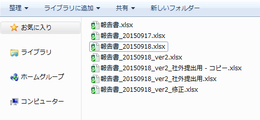

# Dive into Git

---

# Gitってなあに？
Git それは DVCS（Distributed Version Control System：分散バージョン管理システム） というジャンルのソフトウェア。ソフトウェアの変更情報を追跡して管理するための道具。

---

# 変更履歴管理？
- 「このファイル一部書き換えたけど、もしかしたら後でもとに戻すかも…」
- 「気に入らないから別バージョンを作ってみてくれって言われた！」
- 「作業中に別のタスクが割り込んできた！しかもそちらを先に出さないと！」

→ Gitを使えば対応できます！

---

# 履歴管理？なんか面倒そう…

こうなります。いったいどのファイルが最新版でしょうか？

---

# 

---

# 参考文献
1. [Gitのソースコード](https://github.com/git/git)
1. [開発運用研修2018 Git/GitHub 講義編 - サイボウズ](https://speakerdeck.com/cybozuinsideout/2018-05a-git-and-github-lecture)
1. [開発運用研修2018 Git/GitHub 演習編 - サイボウズ](https://speakerdeck.com/cybozuinsideout/2018-05b-git-and-github-exercise)
1. [Pro Git](https://git-scm.com/book/ja/v2)